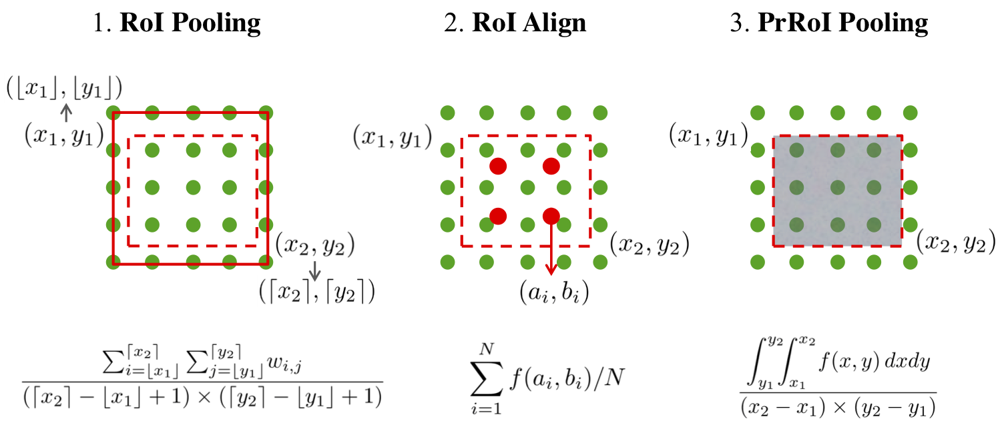

# PreciseRoIPooling
This repo implements the **Precise RoI Pooling** (PrRoI Pooling), proposed in the paper **Acquisition of Localization Confidence for Accurate Object Detection** published at ECCV 2018 (Oral Presentation).

**Acquisition of Localization Confidence for Accurate Object Detection**

_Borui Jiang*, Ruixuan Luo*, Jiayuan Mao*, Tete Xiao, Yuning Jiang_ (* indicates equal contribution.)

https://arxiv.org/abs/1807.11590

## Brief

In short, Precise RoI Pooling is an integration-based (bilinear interpolation) average pooling method for RoI Pooling. It avoids any quantization and has a continuous gradient on bounding box coordinates. It is:

- different from the original RoI Pooling proposed in [Fast R-CNN](https://arxiv.org/abs/1504.08083). PrRoI Pooling uses average pooling instead of max pooling for each bin and has a continuous gradient on bounding box coordinates. That is, one can take the derivatives of some loss function w.r.t the coordinates of each RoI and optimize the RoI coordinates.
- different from the RoI Align proposed in [Mask R-CNN](https://arxiv.org/abs/1703.06870). PrRoI Pooling uses a full integration-based average pooling instead of sampling a constant number of points. This makes the gradient w.r.t. the coordinates continuous.

For a better illustration, we illustrate RoI Pooling, RoI Align and PrRoI Pooing in the following figure. More details including the gradient computation can be found in our paper.

<center></center>

## Implementation

PrRoI Pooling was originally implemented by [Tete Xiao](http://tetexiao.com/) based on MegBrain, an (internal) deep learning framework built by Megvii Inc. It was later adapted into open-source deep learning frameworks. Currently, we only support PyTorch. Unfortunately, we don't have any specific plan for the adaptation into other frameworks such as TensorFlow, but any contributions (pull requests) will be more than welcome.

## Usage (PyTorch 1.0)

In the directory `pytorch/`, we provide a PyTorch-based implementation of PrRoI Pooling. It requires PyTorch 1.0+ and only supports CUDA (CPU mode is not implemented).
Since we use PyTorch JIT for cxx/cuda code compilation, to use the module in your code, simply do:

```
from prroi_pool import PrRoIPool2D

avg_pool = PrRoIPool2D(window_height, window_width, spatial_scale)
roi_features = avg_pool(features, rois)

# for those who want to use the "functional"

from prroi_pool.functional import prroi_pool2d
roi_features = prroi_pool2d(features, rois, window_height, window_width, spatial_scale)
```


## Usage (PyTorch 0.4)

**!!! Please first checkout to the branch pytorch0.4.**

In the directory `pytorch/`, we provide a PyTorch-based implementation of PrRoI Pooling. It requires PyTorch 0.4 and only supports CUDA (CPU mode is not implemented).
To use the PrRoI Pooling module, first goto `pytorch/prroi_pool` and execute `./travis.sh` to compile the essential components (you may need `nvcc` for this step). To use the module in your code, simply do:

```
from prroi_pool import PrRoIPool2D

avg_pool = PrRoIPool2D(window_height, window_width, spatial_scale)
roi_features = avg_pool(features, rois)

# for those who want to use the "functional"

from prroi_pool.functional import prroi_pool2d
roi_features = prroi_pool2d(features, rois, window_height, window_width, spatial_scale)
```

Here,

- RoI is an `m * 5` float tensor of format `(batch_index, x0, y0, x1, y1)`, following the convention in the original Caffe implementation of RoI Pooling, although in some frameworks the batch indices are provided by an integer tensor.
- `spatial_scale` is multiplied to the RoIs. For example, if your feature maps are down-sampled by a factor of 16 (w.r.t. the input image), you should use a spatial scale of `1/16`.
- The coordinates for RoI follows the [L, R) convension. That is, `(0, 0, 4, 4)` denotes a box of size `4x4`.
